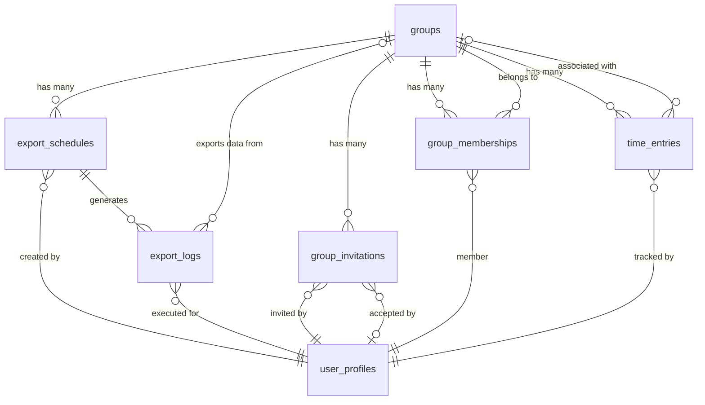

# Data Model: Enhanced Group Management, Export System, and History Improvements

**Feature**: `005-qr-code-and` | **Date**: 2025-09-26

## Entity Overview

This document defines the data entities and relationships needed for enhanced group management, automated exports, and history visualization features.

## Core Entities

### 1. Export Schedule
**Purpose**: Configuration for automated daily exports
**Lifecycle**: Created by group managers, executed by background jobs, can be updated/deleted

```typescript
interface ExportSchedule {
  id: string;                    // UUID primary key
  group_id: string;             // Foreign key to groups table
  created_by: string;           // Foreign key to user who created schedule
  recipient_name: string;       // Name of export recipient
  recipient_email: string;      // Email address for delivery
  export_time: string;          // Time of day for export (HH:MM format)
  export_timezone: string;      // Timezone for scheduling (e.g., "America/Los_Angeles")
  is_hourly_basis: boolean;     // Whether to export hourly breakdown
  target_scope: 'self' | 'group'; // Export scope: own data or group data
  is_active: boolean;           // Whether schedule is currently active
  last_executed_at?: Date;      // Timestamp of last successful execution
  next_execution_at: Date;      // Calculated next execution time
  created_at: Date;             // Record creation timestamp
  updated_at: Date;             // Last modification timestamp
}
```

**Validation Rules**:
- `recipient_email` must be valid email format
- `export_time` must be valid 24-hour format (00:00-23:59)
- `created_by` must be a group manager for the specified `group_id`
- `target_scope` 'group' only allowed for group managers

**Relationships**:
- Belongs to `groups` (many-to-one)
- Created by `user_profiles` (many-to-one)

### 2. Export Log
**Purpose**: Audit trail and status tracking for export executions
**Lifecycle**: Created for each export attempt, preserved for auditing

```typescript
interface ExportLog {
  id: string;                    // UUID primary key
  schedule_id?: string;          // Foreign key to export_schedules (null for manual exports)
  user_id: string;              // User who triggered export (manual) or schedule owner
  group_id?: string;            // Group data exported (null for personal exports)
  export_type: 'manual' | 'scheduled'; // How export was triggered
  format: 'csv' | 'pdf' | 'excel';     // Export format
  date_range_start: Date;       // Start of exported date range
  date_range_end: Date;         // End of exported date range
  status: 'pending' | 'processing' | 'completed' | 'failed'; // Execution status
  file_path?: string;           // Path to generated file (if successful)
  file_size_bytes?: number;     // Size of generated file
  email_sent: boolean;          // Whether email delivery was attempted
  email_delivered: boolean;     // Whether email was successfully delivered
  error_message?: string;       // Error details if status is 'failed'
  execution_duration_ms?: number; // Time taken to generate export
  created_at: Date;             // Export initiation timestamp
  completed_at?: Date;          // Export completion timestamp
}
```

**Validation Rules**:
- `status` must progress logically (pending → processing → completed/failed)
- `file_path` required when status is 'completed'
- `error_message` required when status is 'failed'
- `date_range_end` must be >= `date_range_start`

**Relationships**:
- Belongs to `export_schedules` (many-to-one, optional)
- Belongs to `user_profiles` (many-to-one)
- Belongs to `groups` (many-to-one, optional)

### 3. Enhanced Group Invitation
**Purpose**: Extended invitation tracking with QR code management
**Lifecycle**: Created when QR codes generated, updated when accepted/declined

```typescript
interface GroupInvitation {
  id: string;                    // UUID primary key (existing)
  group_id: string;             // Foreign key to groups table (existing)
  invited_by: string;           // User who created invitation (existing)
  invited_email?: string;       // Email of invitee (existing, optional)
  invitation_code: string;      // Unique invitation code (existing)
  qr_code_data: string;         // QR code content/URL (existing)
  status: 'pending' | 'accepted' | 'declined' | 'expired'; // (existing)
  expires_at: Date;             // Expiration timestamp (existing)

  // New fields for enhanced functionality
  generation_count: number;     // How many times QR regenerated
  last_accessed_at?: Date;      // When invitation was last viewed
  access_count: number;         // Number of times invitation was accessed
  user_agent?: string;          // Browser/device info from last access
  ip_address?: string;          // IP address from last access (for security)
  accepted_by?: string;         // User who accepted invitation
  accepted_at?: Date;           // When invitation was accepted
  declined_at?: Date;           // When invitation was declined
  created_at: Date;             // (existing)
  updated_at: Date;             // (existing)
}
```

**Validation Rules**:
- `invitation_code` must be unique across all invitations
- `expires_at` must be in the future when created
- `generation_count` starts at 1, increments on regeneration
- `accepted_by` required when status is 'accepted'

**Relationships**:
- Belongs to `groups` (many-to-one)
- Created by `user_profiles` (many-to-one, invited_by)
- Accepted by `user_profiles` (many-to-one, accepted_by, optional)

## Extended Entities (Modifications to Existing)

### 4. Enhanced Group Members
**Purpose**: Add role management and metadata for group membership
**Changes**: Extend existing `group_memberships` table

```typescript
interface GroupMembership {
  // Existing fields
  id: string;
  group_id: string;
  user_id: string;
  role: 'manager' | 'member';
  joined_at: Date;

  // New fields for enhanced functionality
  added_by?: string;            // User who added this member (for audit)
  hourly_rate?: number;         // Optional hourly rate set by manager
  can_view_reports: boolean;    // Permission to view group reports
  can_export_data: boolean;     // Permission to export own data
  is_active: boolean;           // Whether membership is currently active
  last_activity_at?: Date;      // Last time user was active in group
  removed_at?: Date;            // When member was removed (soft delete)
  removed_by?: string;          // Who removed the member
  notes?: string;               // Manager notes about member
}
```

**Validation Rules**:
- `hourly_rate` must be >= 0 if specified
- `removed_at` required when `is_active` is false
- Only group managers can set `hourly_rate` for other members

### 5. Enhanced Time Entries
**Purpose**: Add metadata for improved history tracking and exports
**Changes**: Extend existing `time_entries` table

```typescript
interface TimeEntry {
  // Existing fields (no changes)
  id: string;
  user_id: string;
  group_id?: string;
  clock_in: Date;
  clock_out?: Date;
  duration_minutes?: number;
  break_minutes?: number;
  metadata: Record<string, any>;
  created_at: Date;
  updated_at: Date;

  // New computed fields for visualization (calculated, not stored)
  // These will be computed in API responses for charts
  computed_fields?: {
    day_of_week: number;        // 0-6 for chart grouping
    week_number: number;        // Week of year for aggregation
    month_year: string;         // "2025-09" for monthly grouping
    hours_decimal: number;      // Duration as decimal hours for charts
    overtime_minutes: number;   // Calculated overtime based on rules
    billable_amount?: number;   // hourly_rate * hours (if rate set)
  }
}
```

## Data Relationships

### Primary Relationships


### Access Control Matrix
| Entity | Group Manager | Group Member | Other User |
|--------|---------------|--------------|------------|
| export_schedules | CRUD own group | Read own schedules | None |
| export_logs | Read group logs | Read own logs | Read own logs |
| group_invitations | CRUD own group | Read own invitations | None |
| group_memberships | CRUD own group | Read own membership | None |
| time_entries | Read group data | CRUD own data | CRUD own data |

## Indexing Strategy

### Performance Indexes
- `export_schedules.next_execution_at` - for background job queries
- `export_logs.created_at, group_id` - for audit queries
- `group_invitations.invitation_code` - for fast invitation lookups
- `time_entries.user_id, clock_in` - for history page queries
- `time_entries.group_id, clock_in` - for group export queries

### Composite Indexes
- `export_schedules(group_id, is_active, next_execution_at)` - active schedules
- `time_entries(user_id, clock_in DESC)` - user history pagination
- `group_memberships(group_id, is_active)` - active group members

## Data Validation & Constraints

### Business Rules
1. **Export Schedules**: Only group managers can create schedules for their groups
2. **Group Deletion**: Groups with active export schedules must handle cleanup
3. **Member Removal**: Removing members should soft-delete (set is_active = false)
4. **Invitation Expiry**: Expired invitations cannot be accepted
5. **Rate Limits**: Maximum 10 export schedules per group

### Data Integrity
1. **Cascading Deletes**: Group deletion must handle related schedules/invitations
2. **Orphan Prevention**: Remove export schedules when last manager leaves group
3. **Audit Trail**: Never hard-delete export logs or membership history
4. **Time Validation**: clock_out must be after clock_in
5. **Permission Consistency**: Role changes must update related permissions

---

**Data Model Complete**: All entities defined with validation rules and relationships established.