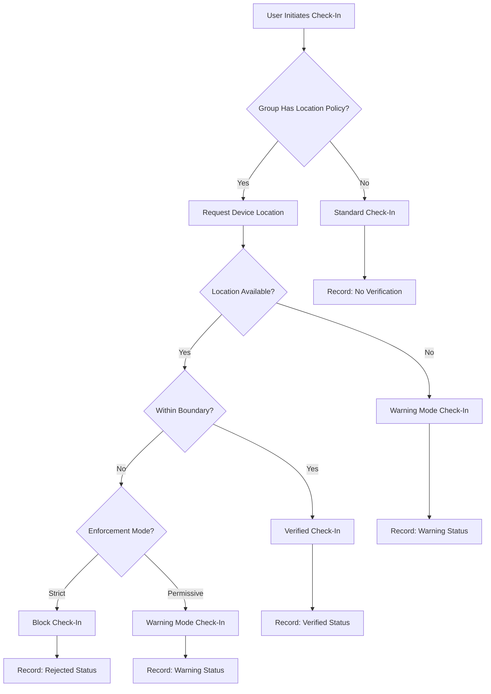
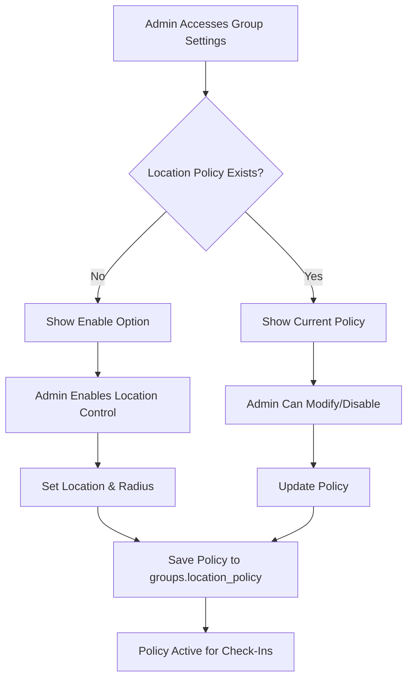

# Data Model: Location-Based Check-In Controls

**Feature**: Location-Based Check-In Controls
**Branch**: `007-i-want-admin`
**Date**: 2025-09-26
**Status**: Design Complete

## Entity Overview

This feature extends the existing time tracking data model with location-based verification capabilities. The design maintains minimal data footprint for privacy compliance while enabling location policy enforcement.

## Core Entities

### 1. Group Location Policy

**Purpose**: Configuration settings that define location restrictions for a group

**Storage**: JSONB column in existing `groups` table

**Schema Extension**:
```sql
-- Add to existing groups table
ALTER TABLE groups
ADD COLUMN location_policy JSONB;

-- Index for policy queries
CREATE INDEX idx_groups_location_policy_enabled
ON groups USING GIN ((location_policy->'enabled'));
```

**Structure**:
```typescript
interface GroupLocationPolicy {
  enabled: boolean;
  center: {
    latitude: number;  // WGS84 decimal degrees
    longitude: number; // WGS84 decimal degrees
  };
  radius_meters: number; // Default: 50
  enforcement_mode: 'strict' | 'permissive'; // Default: 'permissive'
  created_at: string; // ISO timestamp
  created_by: string; // User UUID
  updated_at?: string;
  updated_by?: string;
}
```

**Validation Rules**:
- `latitude`: -90.0 to 90.0
- `longitude`: -180.0 to 180.0
- `radius_meters`: 10 to 1000 (reasonable bounds)
- `enforcement_mode`: enum validation
- Required when `enabled: true`: center coordinates and radius

**Relationships**:
- Belongs to: `groups.id` (one-to-one)
- Managed by: Group administrators only

### 2. Location Verification Record

**Purpose**: Ephemeral verification data captured during check-in attempts

**Storage**: Extension to existing time tracking records

**Schema Extension**:
```sql
-- Add to existing time_entries table
ALTER TABLE time_entries
ADD COLUMN location_verification JSONB;

-- Index for verification queries
CREATE INDEX idx_time_entries_location_verification
ON time_entries USING GIN (location_verification);
```

**Structure**:
```typescript
interface LocationVerification {
  status: 'verified' | 'warning' | 'unavailable' | 'timeout' | 'rejected';
  accuracy_meters?: number; // GPS accuracy if available
  verification_timestamp: string; // ISO timestamp
  enforcement_mode: 'strict' | 'permissive'; // Policy mode at time of check-in
  error_reason?: string; // For debugging failed verifications
  distance_from_center?: number; // Calculated distance in meters (for audit)
}
```

**Validation Rules**:
- `status`: enum validation required
- `accuracy_meters`: 0 to 10000 (reasonable GPS bounds)
- `verification_timestamp`: ISO 8601 format
- `distance_from_center`: 0 to 50000 (reasonable audit range)
- Required fields: status, verification_timestamp, enforcement_mode

**Relationships**:
- Belongs to: `time_entries.id` (one-to-one)
- References: Group location policy (via time_entry.group_id)

**Privacy Compliance**:
- ❌ No GPS coordinates stored
- ❌ No device identifiers stored
- ✅ Only verification result and metadata retained
- ✅ Audit trail for compliance purposes

## State Transitions

### Check-In Flow with Location Verification



### Location Policy Configuration



## Database Relationships

### Extended Groups Table
```sql
groups {
  id: UUID PRIMARY KEY
  name: VARCHAR
  created_by: UUID (FK users.id)
  -- ... existing fields
  location_policy: JSONB -- NEW
}
```

### Extended Time Entries Table
```sql
time_entries {
  id: UUID PRIMARY KEY
  user_id: UUID (FK users.id)
  group_id: UUID (FK groups.id)
  clock_in: TIMESTAMP
  clock_out: TIMESTAMP
  -- ... existing fields
  location_verification: JSONB -- NEW
}
```

## API Data Contracts

### Group Location Policy Operations

```typescript
// GET /api/v1/groups/{id}/location-policy
interface GetLocationPolicyResponse {
  policy: GroupLocationPolicy | null;
  can_modify: boolean; // User permission check
}

// PUT /api/v1/groups/{id}/location-policy
interface UpdateLocationPolicyRequest {
  enabled: boolean;
  center?: {
    latitude: number;
    longitude: number;
  };
  radius_meters?: number;
  enforcement_mode?: 'strict' | 'permissive';
}

// POST /api/v1/groups/{id}/location-policy/verify
interface VerifyLocationRequest {
  latitude: number;
  longitude: number;
  accuracy: number;
}

interface VerifyLocationResponse {
  verified: boolean;
  status: LocationVerification['status'];
  distance_meters?: number;
  message?: string;
}
```

### Check-In with Location Verification

```typescript
// POST /api/v1/time/checkin
interface CheckInRequest {
  group_id?: UUID;
  location?: {
    latitude: number;
    longitude: number;
    accuracy: number;
  };
}

interface CheckInResponse {
  entry: TimeEntry;
  location_verification?: LocationVerification;
  warnings?: string[];
}
```

## Performance Considerations

### Database Indexes
```sql
-- Fast policy lookups
CREATE INDEX idx_groups_location_policy_enabled
ON groups USING GIN ((location_policy->'enabled'))
WHERE location_policy->>'enabled' = 'true';

-- Verification audit queries
CREATE INDEX idx_time_entries_location_status
ON time_entries USING GIN ((location_verification->'status'));

-- Group verification history
CREATE INDEX idx_time_entries_group_location
ON time_entries (group_id, created_at)
WHERE location_verification IS NOT NULL;
```

### Query Optimization
- Location policy lookup: Single JSONB query on groups table
- Verification logging: Batch inserts for high-frequency check-ins
- Audit queries: Composite indexes on group_id + timestamp
- Distance calculations: Server-side PostGIS functions

## Migration Strategy

### Phase 1: Schema Updates
```sql
-- Add location_policy column to groups
ALTER TABLE groups ADD COLUMN location_policy JSONB;

-- Add location_verification column to time_entries
ALTER TABLE time_entries ADD COLUMN location_verification JSONB;

-- Create necessary indexes
-- (indexes listed above)
```

### Phase 2: Data Migration
- No existing data migration required
- New policies start as NULL (disabled)
- Existing time entries have NULL verification (no location control)

### Phase 3: Feature Rollout
- Location policies disabled by default
- Administrators opt-in per group
- Existing check-in flows unchanged until policy enabled

## Validation & Constraints

### Business Rules
1. Only group administrators can modify location policies
2. Location policies are optional (NULL = disabled)
3. One location policy per group maximum
4. Check-in verification respects policy enforcement mode
5. Historical verification records are immutable

### Data Integrity
1. Location policy JSONB validation via CHECK constraints
2. Verification status enum validation
3. Foreign key relationships maintained
4. Audit timestamps required for all policy changes

### Privacy Compliance
1. No GPS coordinates persisted beyond verification
2. Verification metadata only (status, accuracy, distance)
3. User consent for location access handled at client level
4. Location policies visible to group members

This data model provides the foundation for implementing location-based check-in controls while maintaining data integrity, performance, and privacy compliance requirements.