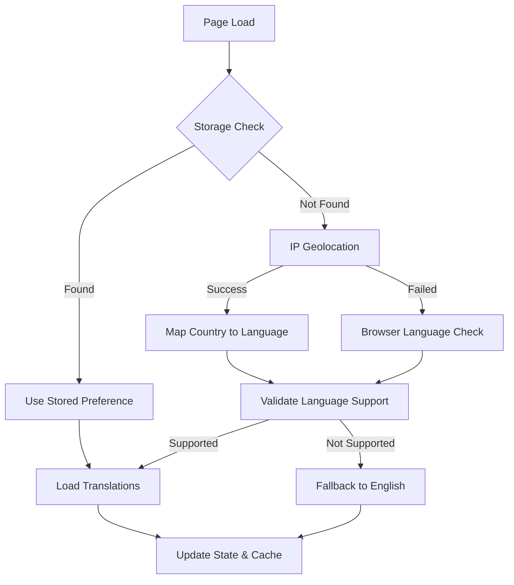
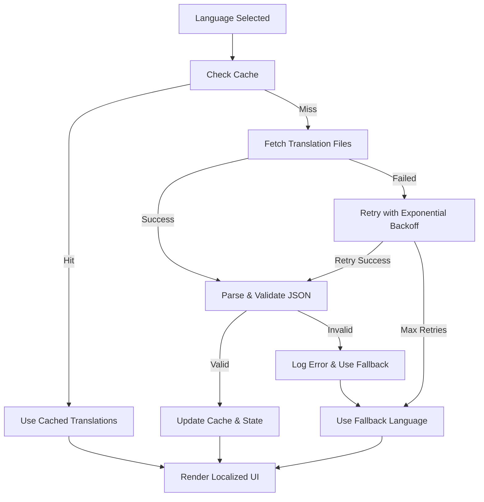

# Data Model: Multi-Language Support with Automatic Translation

**Feature**: Multi-Language Support with Automatic Translation
**Branch**: `008-i-also-want`
**Date**: 2025-09-26
**Status**: Design Complete

## Entity Overview

This feature introduces internationalization (i18n) capabilities to the time tracking application through structured translation files, language detection, and user preference management. The data model focuses on client-side translation management with minimal server-side storage requirements.

## Core Entities

### 1. Translation File

**Purpose**: Language-specific JSON files containing localized text for all user interface elements

**Storage**: Static files in `/public/locales/` directory structure

**Schema Structure**:
```
public/locales/
├── en/ (English - base language)
├── es/ (Spanish)
├── fr/ (French)
├── de/ (German)
└── it/ (Italian)

Each language directory contains:
├── common.json      # Shared UI elements
├── dashboard.json   # Dashboard-specific strings
├── auth.json        # Authentication flows
├── settings.json    # Settings and preferences
├── time.json        # Time tracking interface
└── export.json      # Export functionality
```

**File Content Structure**:
```typescript
interface TranslationFile {
  [namespace: string]: {
    [key: string]: string | TranslationObject;
  };
}

interface TranslationObject {
  [nestedKey: string]: string | TranslationObject;
}

// Example: common.json
{
  "buttons": {
    "save": "Save",
    "cancel": "Cancel",
    "delete": "Delete",
    "edit": "Edit"
  },
  "navigation": {
    "dashboard": "Dashboard",
    "settings": "Settings",
    "history": "History",
    "export": "Export",
    "logout": "Log Out"
  },
  "status": {
    "loading": "Loading...",
    "error": "An error occurred",
    "success": "Operation successful",
    "noData": "No data available"
  }
}
```

**Validation Rules**:
- All translation keys must exist in base English files
- No missing keys allowed in target language files
- String interpolation variables must match across languages
- Maximum string length: 500 characters per translation
- File size limit: 50KB per translation file

### 2. Language Configuration

**Purpose**: Application configuration defining supported languages and formatting rules

**Storage**: Client-side configuration object and localStorage

**Schema**:
```typescript
interface LanguageConfiguration {
  supportedLanguages: SupportedLanguage[];
  defaultLanguage: string;
  fallbackLanguage: string;
  detectionOrder: ('geolocation' | 'browser' | 'storage' | 'default')[];
  cacheSettings: CacheSettings;
  countryLanguageMap: Record<string, string>;
}

interface SupportedLanguage {
  code: string;           // ISO 639-1 code (en, es, fr, de, it)
  name: string;           // Native language name
  englishName: string;    // English name for admin interfaces
  flag: string;           // Flag emoji or icon identifier
  direction: 'ltr' | 'rtl'; // Text direction (all initial languages are LTR)
  dateFormat: string;     // Locale-specific date format preference
  numberFormat: {
    decimal: string;      // Decimal separator
    thousands: string;    // Thousands separator
  };
}

interface CacheSettings {
  translationTTL: number;    // Translation cache time-to-live (24 hours)
  preferenceTTL: number;     // User preference cache (30 days)
  preloadLanguages: string[]; // Languages to preload (common alternatives)
}
```

**Default Configuration**:
```typescript
const DEFAULT_LANGUAGE_CONFIG: LanguageConfiguration = {
  supportedLanguages: [
    {
      code: 'en',
      name: 'English',
      englishName: 'English',
      flag: '🇺🇸',
      direction: 'ltr',
      dateFormat: 'MM/dd/yyyy',
      numberFormat: { decimal: '.', thousands: ',' }
    },
    {
      code: 'es',
      name: 'Español',
      englishName: 'Spanish',
      flag: '🇪🇸',
      direction: 'ltr',
      dateFormat: 'dd/MM/yyyy',
      numberFormat: { decimal: ',', thousands: '.' }
    },
    // ... French, German, Italian configurations
  ],
  defaultLanguage: 'en',
  fallbackLanguage: 'en',
  detectionOrder: ['storage', 'geolocation', 'browser', 'default'],
  countryLanguageMap: {
    'US': 'en', 'GB': 'en', 'CA': 'en', 'AU': 'en',
    'ES': 'es', 'MX': 'es', 'AR': 'es', 'CO': 'es',
    'FR': 'fr', 'BE': 'fr', 'CH': 'fr',
    'DE': 'de', 'AT': 'de',
    'IT': 'it'
  }
};
```

### 3. Language Detection Result

**Purpose**: Information about user's detected language preference and decision process

**Storage**: Runtime state and localStorage for persistence

**Schema**:
```typescript
interface LanguageDetectionResult {
  detectedLanguage: string;
  detectionMethod: 'storage' | 'geolocation' | 'browser' | 'default';
  confidence: number;          // 0-1 confidence score
  geolocationData?: {
    country: string;           // ISO country code
    region?: string;           // State/region if available
    city?: string;             // City if available
    accuracy: 'country' | 'region' | 'city';
  };
  browserLanguages: string[]; // Ordered list from navigator.languages
  fallbackReason?: string;    // Why fallback was used
  timestamp: string;          // ISO timestamp of detection
}
```

### 4. User Language Preference

**Purpose**: Persistent storage of user's language choice and related settings

**Storage**: Browser localStorage with optional server-side user profile integration

**Schema**:
```typescript
interface UserLanguagePreference {
  selectedLanguage: string;        // User's chosen language
  autoDetection: boolean;          // Whether to use automatic detection
  lastUpdated: string;             // ISO timestamp
  detectionHistory: LanguageDetectionResult[]; // Last 5 detection results
  customOverrides?: {
    dateFormat?: string;           // User-specific date format preference
    timeFormat?: '12h' | '24h';    // Time display preference
    numberFormat?: 'auto' | 'us' | 'eu'; // Number format preference
  };
}
```

### 5. Translation Loading State

**Purpose**: Runtime state management for translation loading and caching

**Storage**: React state and memory cache

**Schema**:
```typescript
interface TranslationLoadingState {
  currentLanguage: string;
  loadingStates: Record<string, LoadingStatus>; // Per namespace
  cache: TranslationCache;
  errors: TranslationError[];
}

interface LoadingStatus {
  status: 'idle' | 'loading' | 'loaded' | 'error';
  lastLoaded?: string;    // ISO timestamp
  retryCount: number;
}

interface TranslationCache {
  [language: string]: {
    [namespace: string]: {
      data: Record<string, any>;
      expires: number;      // Timestamp
      version: string;      // For cache invalidation
    };
  };
}

interface TranslationError {
  language: string;
  namespace: string;
  error: string;
  timestamp: string;
  retryable: boolean;
}
```

## Data Relationships

### Translation File Hierarchy
```
LanguageConfiguration
├── defines supportedLanguages[]
└── maps to TranslationFile structure

TranslationFile (per language/namespace)
├── referenced by LanguageConfiguration
├── loaded based on UserLanguagePreference
└── cached in TranslationLoadingState
```

### User Preference Flow
```
LanguageDetectionResult
├── influences UserLanguagePreference
└── triggers TranslationFile loading

UserLanguagePreference
├── overrides LanguageDetectionResult
├── persists across sessions
└── drives TranslationLoadingState
```

## State Transitions

### Language Detection Flow


### Translation Loading Flow


## Performance Considerations

### File Size Optimization
- Maximum 50KB per translation file
- Namespace splitting to enable lazy loading
- Compression via gzip serving
- CDN caching with long expiration

### Memory Management
- LRU cache eviction for unused languages
- Cleanup of old detection history (keep last 5)
- Debounced language switching to prevent thrashing

### Network Optimization
- Preload common language alternatives
- HTTP/2 multiplexing for parallel namespace loading
- Service worker caching for offline support

## Validation & Error Handling

### Translation File Validation
```typescript
interface ValidationRules {
  requiredKeys: string[];           // Keys that must exist
  maxStringLength: number;          // 500 characters
  allowedInterpolation: RegExp;     // {{variable}} pattern
  forbiddenHtml: RegExp;           // No HTML tags allowed
}

interface ValidationResult {
  isValid: boolean;
  errors: ValidationError[];
  warnings: ValidationWarning[];
}
```

### Error Recovery Strategies
1. **Missing Translation**: Fall back to English key or show key name
2. **File Load Error**: Retry with exponential backoff, then use cached version
3. **Invalid JSON**: Log error and use previous version or fallback language
4. **Network Error**: Use cached translations and show offline indicator

This data model provides a robust foundation for implementing multi-language support while maintaining performance and user experience standards.